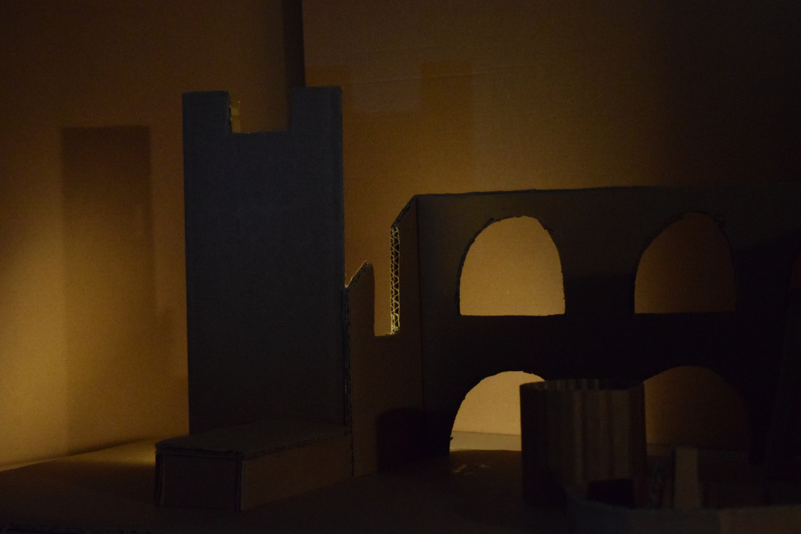
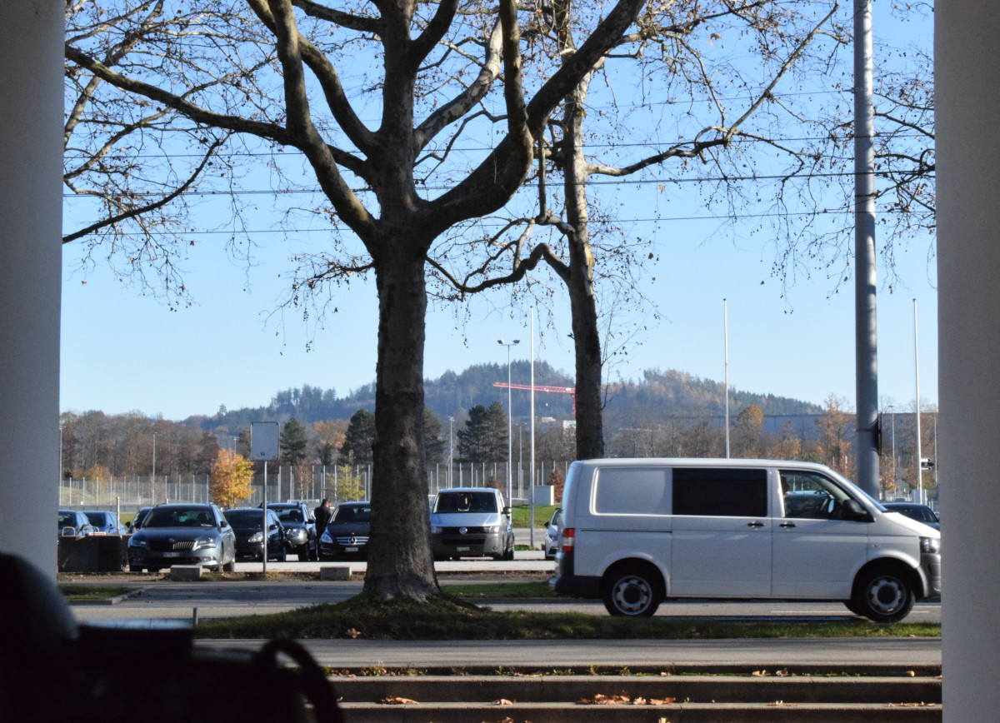

+++
title = "Die Ruine"
date = "2021-05-05"
draft = false
pinned = false
tags = []
image = "dsc_0082-klein.jpg"
description = "Eine Ruine aus Karton hergestellt. Ich habe verschiedene Lichteffekte ausprobiert, um das es eine düstere Stimmung auswirkt dem Betrachter. "
footnotes = ""
+++
Ich habe gelernt ein Model herzustellen aus Karton. Dabei habe ich einzelne Teile mit Japanmesser geschnitten und aufgeklebt zusammen. Ich habe verschiede Lampe mit Farbigen Blättern verwendet, um die Lichtstrahlen zu verändern. 

